<div align="center">

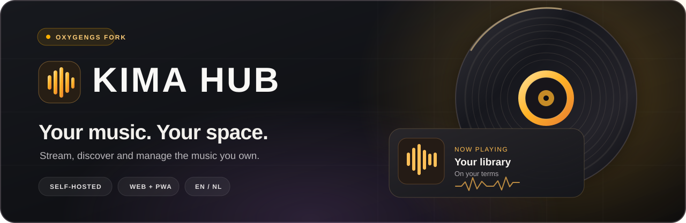

# Kima Hub

**A beautiful home for the music you own.**

A modern, self-hosted listening experience with a distinctive dark interface, personal discovery, library tools and the freedom to run it all on your own server.

[](https://github.com/OxygenGS/kima-hub/releases/tag/v1.22.0)
[](https://github.com/OxygenGS/kima-hub/pkgs/container/kima-hub)
[](https://github.com/OxygenGS/kima-hub/actions/workflows/docker-publish.yml)
[](docs/internationalization.md)
[](LICENSE)

**[Explore](#the-experience) · [Settings Studio](#settings-studio-20) · [Features](#features) · [Install](#quick-start) · [Documentation](#documentation)**

</div>

---

## The experience

One music space for your favorite albums, artists, playlists and discoveries. Built for a personal library rather than a subscription catalog.

<div align="center">
  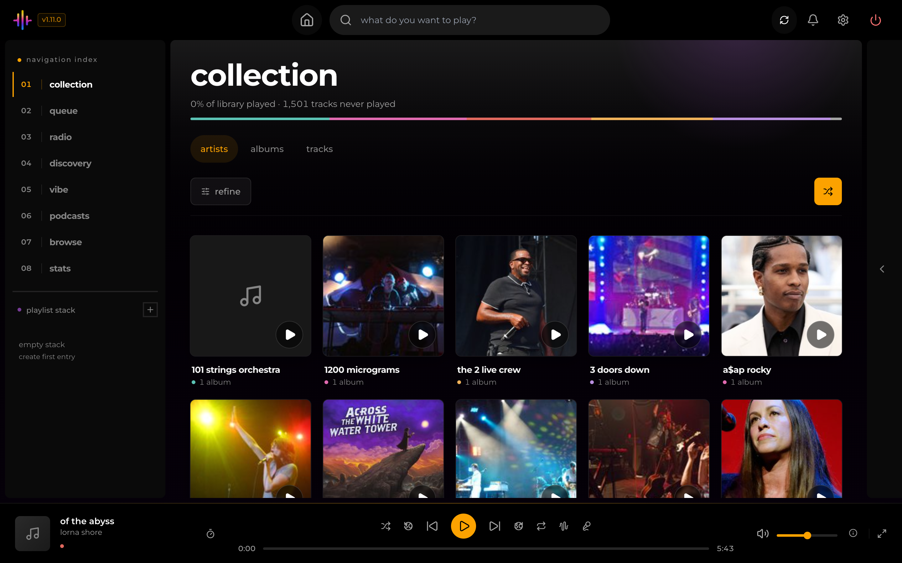
  <sub>Home · your library, listening and discoveries together</sub>
</div>

## Settings Studio 2.0

**New in [v1.22.0](https://github.com/OxygenGS/kima-hub/releases/tag/v1.22.0).** The old, endless settings screen is gone. A focused settings workspace now matches the rest of the OxygenGS theme: dark surfaces, warm amber accents, thoughtful spacing and clearer controls.

<div align="center">
  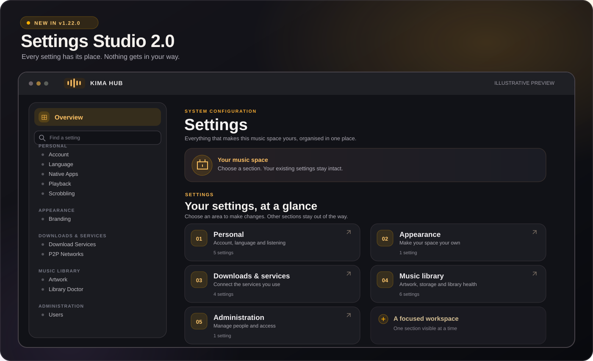
  <sub>Illustrated preview based on the v1.22.0 interface structure; not a screenshot of a live installation.</sub>
</div>

| Find what matters | Change settings with confidence |
| :--- | :--- |
| **Five areas:** Personal, Appearance, Downloads & services, Music library, Administration. | **One active panel at a time**, rather than a giant page of unrelated options. |
| Searchable desktop navigation and mobile-friendly category shortcuts. | Unsaved inputs remain intact when switching panels, with the existing save workflow. |
| Existing deep links continue to work; obsolete navigation is removed. | Admin-only controls stay permission-restricted; existing service connections and settings APIs are preserved. |

[See all settings](docs/configuration.md) · [Read the v1.22.0 release notes](https://github.com/OxygenGS/kima-hub/releases/tag/v1.22.0)

## Made for your music

### Explore the library

<table>
<tr>
<td width="50%" align="center">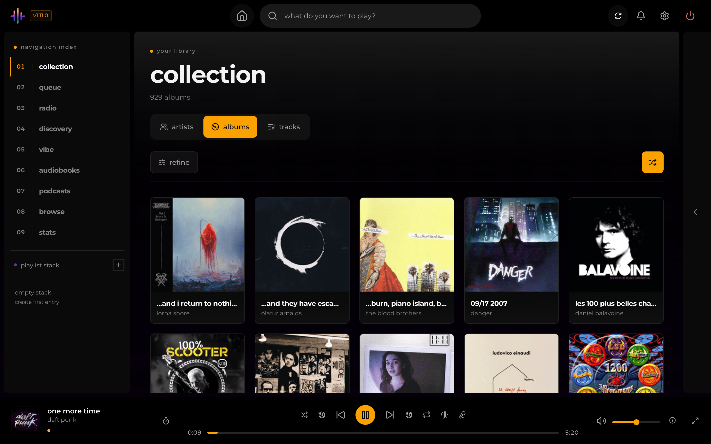<sub>Browse your library</sub></td>
<td width="50%" align="center">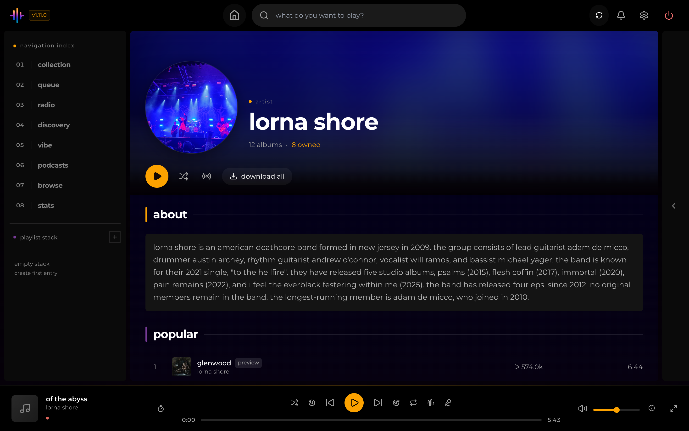<sub>Artists, albums and tracks</sub></td>
</tr>
<tr>
<td width="50%" align="center">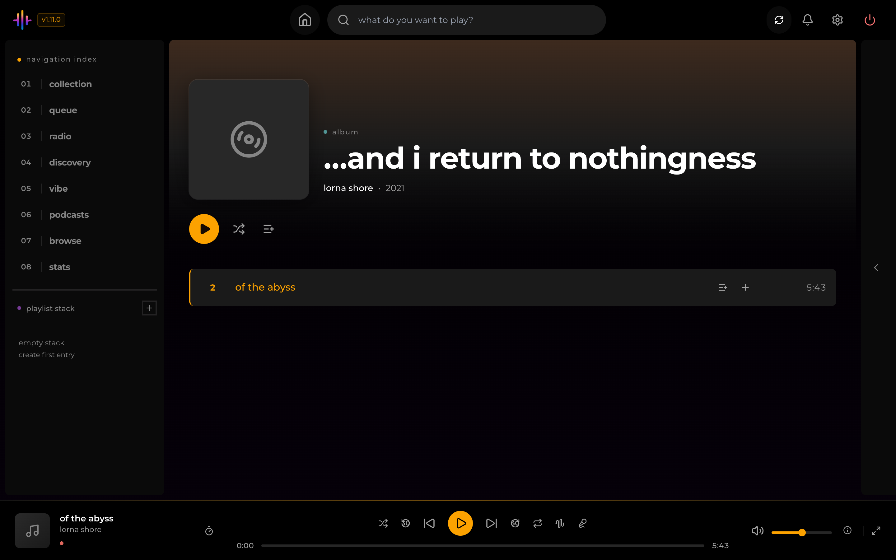<sub>Albums and track lists</sub></td>
<td width="50%" align="center">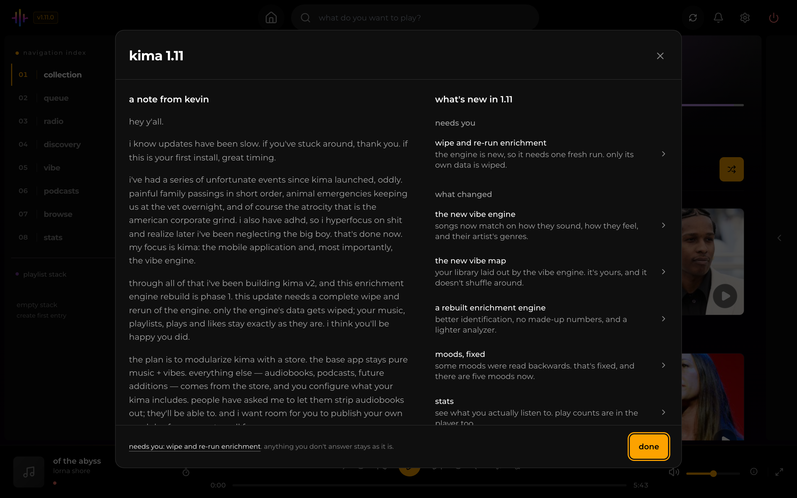<sub>Your personal collection</sub></td>
</tr>
</table>

### Find your next favorite

Go beyond artist and album lists. **Vibe Map** places analyzed tracks in an interactive music space; **Mood Mixer**, radio and discovery views help you build something new from what you already have.

<table>
<tr>
<td width="50%" align="center">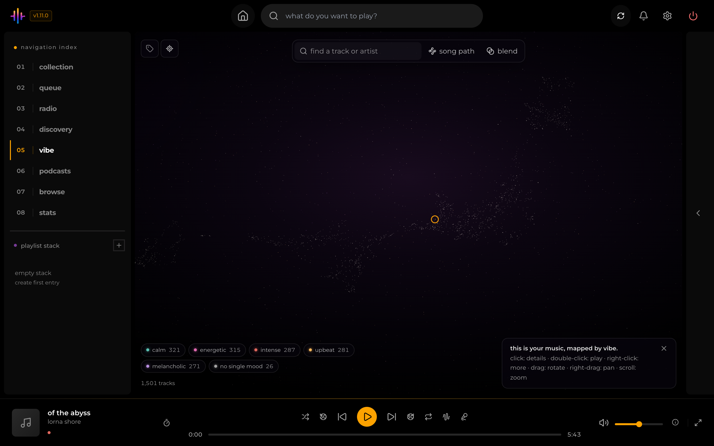<sub>Vibe Map · explore relationships between tracks</sub></td>
<td width="50%" align="center">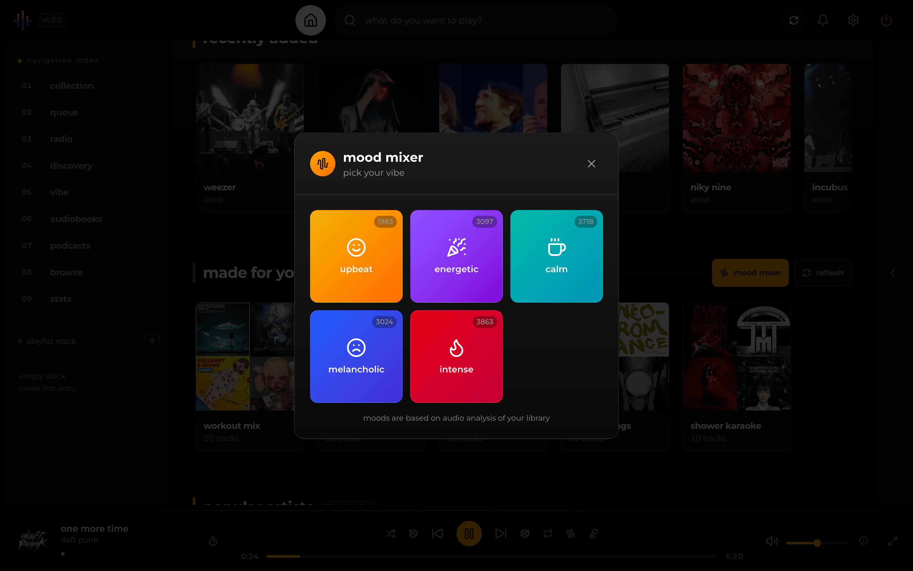<sub>Mood Mixer · shape the next listening session</sub></td>
</tr>
</table>

Vibe also includes **Match Vibe**, **Song Path** and **Blend** for listening paths and mixes built from audio similarity. [Explore the listening experience](docs/using-kima.md)

### Built for smaller screens, too

<div align="center">
<table>
<tr>
<td width="33%" align="center">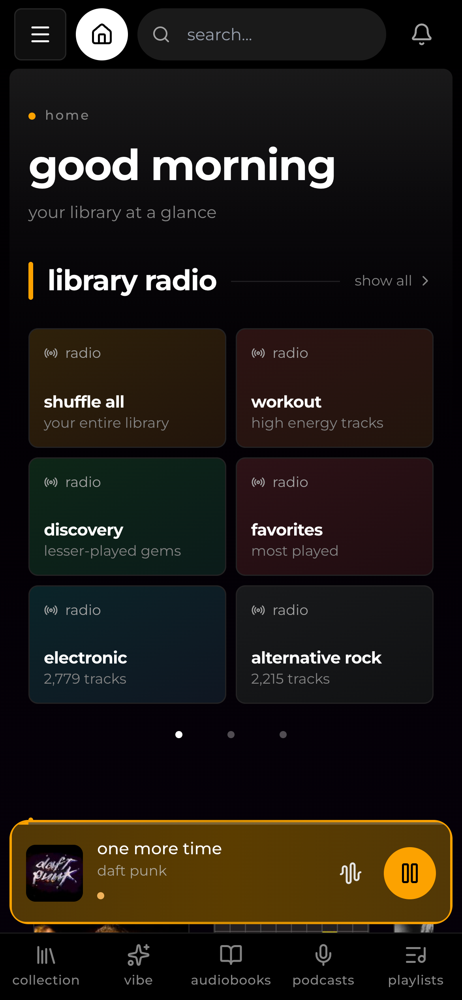</td>
<td width="33%" align="center">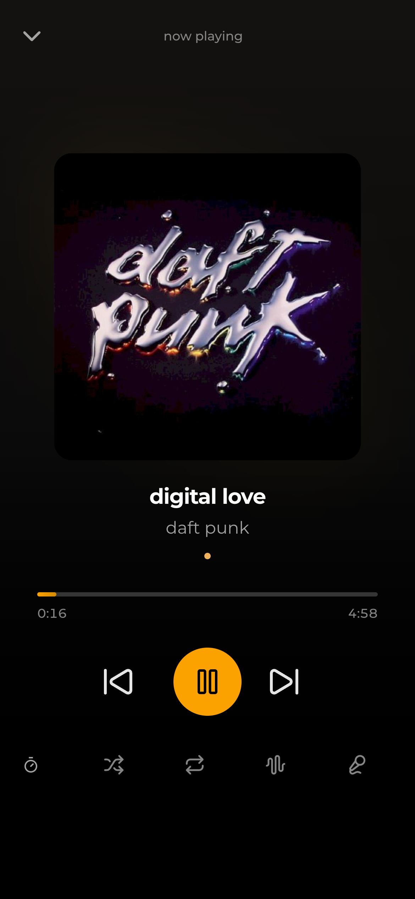</td>
<td width="33%" align="center">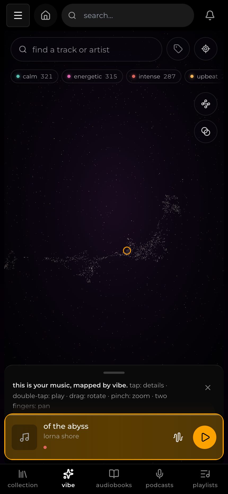</td>
</tr>
<tr><td align="center"><sub>Home</sub></td><td align="center"><sub>Player</sub></td><td align="center"><sub>Vibe</sub></td></tr>
</table>
</div>

Responsive desktop and mobile layouts, installable browser-based PWA support and a dedicated television-browser layout. Existing repository screenshots are illustrative of product features and may differ slightly from the latest release.

## Features

| Listen & discover | Own & manage |
| :--- | :--- |
| **Music playback** — queue, shuffle, repeat, lyrics, playlists, radio and sleep timer. | **Local music library** — keep your own files and use your own storage paths. |
| **Personal discovery** — Mood Mixer, Vibe Map, Similar, Song Path, Blend and listening stats. | **Library Doctor** — inspect missing tracks, album associations and library health. |
| **Playlists** — make, reorder, share and import from supported links or M3U. | **Artwork tools** — repair missing artist imagery and album covers without overwriting curated artwork. |
| **Podcasts and audiobooks** — podcast subscriptions and optional Audiobookshelf playback. | **Downloads** — per-user Kima job history with optional Lidarr and Soulseek workflows. |
| **Modern music clients** — compatible OpenSubsonic players, including Symfonium and Feishin. | **Server controls** — separate users and roles, 2FA, branding, language and audio quality settings. |

### Connect the tools you already use

| Integration | What it adds |
| :--- | :--- |
| **Lidarr** | Request albums using your existing automation and library-import workflow. |
| **Soulseek / slskd** | Search for and download individual tracks using the built-in client or an external slskd server. |
| **OpenSubsonic** | Connect compatible music apps, including **Symfonium** and **Feishin**; per-client Native Apps keys support modern authentication without requiring legacy login modes. |
| **Audiobookshelf** | Bring audiobooks and podcast libraries into your listening space. |
| **ListenBrainz** | Optional scrobbling and listening-related recommendations. |
| **Fanart.tv / AcoustID** | Optional artwork enrichment and audio identification. |

Services are optional: Kima runs as a self-hosted music server without requiring Lidarr, Soulseek or Audiobookshelf. The experimental **Downtify connector was retired in v1.21.0** and is **not** part of the current app; previously imported files and historical database records are preserved.

[Integration guide](docs/integrations.md) · [Native music clients](docs/subsonic.md) · [Library Doctor](docs/library-doctor.md) · [Privacy](PRIVACY.md)

## Quick start

**Current stable version:** [v1.22.0](https://github.com/OxygenGS/kima-hub/releases/tag/v1.22.0) · **Image:** `ghcr.io/oxygengs/kima-hub:v1.22.0` · **Platforms:** `linux/amd64` and `linux/arm64`.

**Versioned image:** `ghcr.io/oxygengs/kima-hub:v1.22.0`

The all-in-one image bundles the frontend, API, PostgreSQL, Redis and audio-analysis services. All you need is Docker, a real music directory and a persistent `/data` volume.

### Docker — new installations only

```bash
docker run -d \
  --name kima \
  --restart unless-stopped \
  -p 3030:3030 \
  -v /absolute/path/to/music:/music \
  -v kima_data:/data \
  ghcr.io/oxygengs/kima-hub:v1.22.0
```

Replace `/absolute/path/to/music` with an **existing** host directory holding your music. Open **http://localhost:3030** from the Docker host and finish the first-run setup.

### Docker Compose / Dockge — new installations only

The [production Compose file](docker-compose.prod.yml) pins a versioned source image and requires `MUSIC_PATH` to point to an existing music directory. During release preparation, the source default can be newer than the published stable image; set `VERSION=v1.22.0` explicitly until v1.23.0 has been published.

```bash
MUSIC_PATH=/absolute/path/to/music VERSION=v1.22.0 \
  docker compose -f docker-compose.prod.yml up -d
```

The [optional companion stack](docker-compose.server.yml) includes additional media services if you choose to run them. [Full installation guide](docs/install.md)

> [!IMPORTANT]
> **Already running Kima? Do not replace your existing Compose/Dockge stack with these new-install examples.** Preserve the original project name, complete `/data` volume, and existing `/music` and `/downloads` mounts. Back up the **stopped** `/data` volume, verify a separate restore and only then change a pinned image version. Database migrations may make a rollback without the original data backup impossible. See [safe updates and recovery](docs/safe-aio-updates.md).

## Security and release quality

- Stable releases use native AMD64/ARM64 builds, checks and an explicit security-reviewed publication process. The `:latest` image alias is **not** automatically advanced.
- The v1.22.0 image still has reported HIGH/CRITICAL security advisories. Passing the automated release gates does **not** mean zero vulnerabilities. Review the [current image-security report](docs/image-security.md) and restrict network exposure appropriately.
- Applications, media mounts and running Docker containers **are not** changed by editing this GitHub repository or publishing a release.

[Security policy](SECURITY.md) · [Published image advisories](docs/image-security.md) · [Safe AIO upgrades](docs/safe-aio-updates.md) · [Privacy policy](PRIVACY.md)

## Documentation

| Start exploring | Operate and improve |
| :--- | :--- |
| [Install & upgrade](docs/install.md) | [Settings Studio & configuration](docs/configuration.md) |
| [Using Kima](docs/using-kima.md) | [Administration](docs/administration.md) |
| [Integrations](docs/integrations.md) | [Library health & repairs](docs/library-doctor.md) |
| [Symfonium, Feishin & OpenSubsonic](docs/subsonic.md) | [Image security](docs/image-security.md) |
| [User permissions](docs/user-permissions.md) | [Safe backups & rollback](docs/safe-aio-updates.md) |
| [Full changelog](CHANGELOG.md) | [Development](docs/development.md) |
| [Branding](docs/instance-branding.md) | [Upstream compatibility](docs/upstream-compatibility.md) |

## About the fork

**OxygenGS Kima Hub** is an independent community fork of [Kima Hub by Chevron7Locked](https://github.com/Chevron7Locked/kima-hub), not an official upstream release. The aim is to make a more polished, capable and approachable self-hosted music application while keeping upstream improvements practical to integrate.

Licensed under [GNU GPL v3.0](LICENSE). Original contributions and third-party components remain with their respective owners; see the [audio model notices](services/audio-analyzer/models/LICENSE-upf-models).

<div align="center">

**Your music. Your space. Your server.**

[Releases](https://github.com/OxygenGS/kima-hub/releases) · [Installation](docs/install.md) · [Changelog](CHANGELOG.md)

</div>
